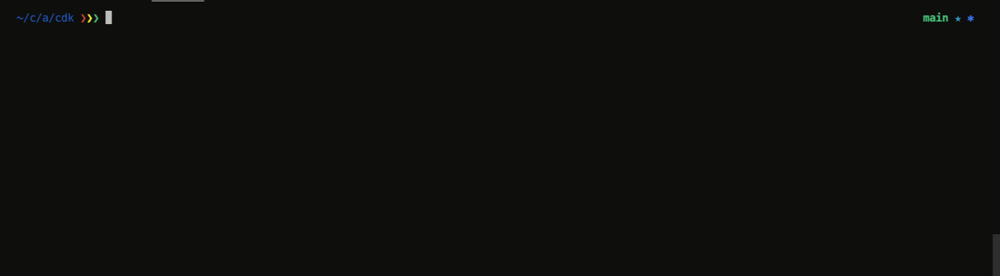

# App Runner VPC Connector Example

### Description

In this walkthrough, we will deploy a web facing API service to AWS App Runner that relies on a backend database (RDS cluster) and private API service (Amazom ECS Fargate Service) running in private subnets in a VPC.
The goal of this walkthrough is to showcase the VPC integration with AWS App Runner and help users better understand how they can connect their App Runner services to resources in their VPC's.

### Walkthrough

The entire environment has been automated using the AWS CDK (Cloud Development Kit), which means the deployment is going to be relatively straightforward and only require a single command to get everything up and running.
Prior to deploying the environment, we will walk through the code to better understand what we are deploying.
Let's get right into it.

#### <a name="meetapp"></a> Meet the application

To get things started, let's review the application.

The application is quite simple and is designed to show off the App Runner VPC integration feature.
When accessing the root of the API endpoint, it stores the timestamp and user agent in a Postgres database.
In addition, the frontend offers two paths to showcase the connectivity between the App Runner service and the resources in the VPC.

- `/recent-visits`: View the last ten visits to the root of the url.
- `/ecs-private-service`: View the details of a private service running in the VPC in Amazon ECS.

The application is comprised of two services:

- The frontend API, which writes/reads to a database and communicates to a private service running in Amazon ECS over DNS.
- The backend ecs private API, which returns the task metadata related to the ECS service.


#### <a name="codereview"></a> Code Review

As mentioned earlier, the environment is defined in Typescript using the AWS Cloud Development Kit.
There are two files in which the code resides:

- `bin/apprunner-vpc-demo.ts`: This is where we instantiate the CDK app and stack.
- `lib/apprunner-vpc-demo-stack.ts`: Here is where all of the code lives that defines our stack resources and dependencies.

In the below sections we will review the code in chunks and review what we are building.

<details><summary> Base resources </summary>

We need a VPC and an ECS Cluster to run our private ECS service.
In the below code, with one line we are creating a VPC that will build private and public subnets across three availability zones.
As we progress through the walkthrough, we will see a common theme: take advantage of high level constructs that build resources based on good practices when possible.
This saves us the time and effort which can be shifted elsewhere.
Of course, every environment has it's quirks that require some form of customization, and this one is no different.
We'll see this later on in the walkthrough.

The ECS cluster construct has a few more inputs to customize based on our needs.
We want the cluster to reside in the VPC created above and want to create a namespace for service discovery (for services to communicate with this service via a friendly DNS name).
Lastly, we enable the ecs excute command at the cluster level just in case we need to troubleshoot our tasks via ECS exec.
All of that is being created in less than 10 lines of code.

```typescript
const demoVpc = new ec2.Vpc(this, "AppRunnerDemoVPC");

const demoECSCluster = new ecs.Cluster(this, "AppRunnerDemoCluster", {
  vpc: demoVpc,
  defaultCloudMapNamespace: {
    name: "apprunner.demo",
    vpc: demoVpc,
  },
  executeCommandConfiguration: {
    logging: ecs.ExecuteCommandLogging.DEFAULT,
  },
});
```

</details>

<details><summary> Database resources </summary>

To create our database cluster in RDS, we're going to use the `ServerlessCluster` construct.
Once again this construct is going to many resources on our behalf, with only a few lines defining our requirements.
Things get interesting here, and let me explain the magic after the creation of the database cluster.
I am a big fan of automating everything that is within reason and makes sense for the scenario.
In this case, I need a database and table created on the RDS cluster.
To do this in an automated way I need to ensure that the cluster is up, I have credentials to access to host, and then run the proper sql commands.

This is where the `AwsCustomResource` construct comes to save the day!
This construct is perfect for one off scenarios where you need issue an AWS API call that doesn't have direct CloudFormation support.
In this case, we want to run the `RDSDataService` `executeStatement` command, which executes a sql statement in the database host.
I don't have to hardcode the database user credentials as the command will programatically access the required values to access the database host via a secret json object stored in Secrets Manager (the secret was created as a part of the ServerlessCluster construct).

```typescript
const dbCluster = new rds.ServerlessCluster(this, "AppRunnerDemoDatabase", {
  engine: rds.DatabaseClusterEngine.auroraPostgres({
    version: rds.AuroraPostgresEngineVersion.VER_10_14,
  }),
  vpc: demoVpc,
  enableDataApi: true,
  removalPolicy: RemovalPolicy.DESTROY,
  scaling: {
    autoPause: Duration.seconds(0),
  },
});

const createDatabase = new cr.AwsCustomResource(this, "RDSCreateDatabase", {
  policy: cr.AwsCustomResourcePolicy.fromSdkCalls({
    resources: cr.AwsCustomResourcePolicy.ANY_RESOURCE,
  }),
  logRetention: RetentionDays.ONE_WEEK,
  onCreate: {
    service: "RDSDataService",
    action: "executeStatement",
    physicalResourceId: cr.PhysicalResourceId.of(dbCluster.clusterIdentifier),
    parameters: {
      resourceArn: dbCluster.clusterArn,
      secretArn: dbCluster.secret?.secretArn,
      sql: "CREATE DATABASE apprunnerdemo OWNER postgres;",
    },
  },
});

const createTable = new cr.AwsCustomResource(this, "RDSCreateTable", {
  policy: cr.AwsCustomResourcePolicy.fromSdkCalls({
    resources: cr.AwsCustomResourcePolicy.ANY_RESOURCE,
  }),
  logRetention: RetentionDays.ONE_WEEK,
  onCreate: {
    service: "RDSDataService",
    action: "executeStatement",
    physicalResourceId: cr.PhysicalResourceId.of(dbCluster.clusterIdentifier),
    parameters: {
      resourceArn: dbCluster.clusterArn,
      secretArn: dbCluster.secret?.secretArn,
      sql: "CREATE TABLE access (last_update TIMESTAMP, user_agent VARCHAR (250));",
      database: "apprunnerdemo",
    },
  },
});

createDatabase.node.addDependency(dbCluster);
createTable.node.addDependency(createDatabase);
dbCluster.secret?.grantRead(createDatabase);
dbCluster.secret?.grantRead(createTable);

dbCluster.connections.allowFrom(
  dbCluster,
  ec2.Port.tcp(5432),
  "Allow traffic on 5432 for any resource with this sec grp attached"
);

const dbSecrets = dbCluster.secret ?? new secretsmgr.Secret(this, "RDSSecret");
```

</details>

<details><summary> ECS Private Service </summary>

Launching a container to Amazon ECS is straightforward (once you familiarize yourself with the terminology) and can be broken down into three steps:

1. Define the task definition for the configuration around how your containers will run.
   Choosing where to run your container (Fargate, EC2, ECS Anywhere), logging configurations, volumes, IAM roles to attach, etc.
2. Within the task definition, define the containers that will run when the task is launched.
   Here is where I configure container specific requirements, which in this instance is only to define the port that my container exposes and which container image to use. You can see in the code below that we are using the `ContainerImage` construct and taking advantage of the `fromAsset` method which will locate the Dockerfile and the CDK will build the image on our behalf and create/push to an ECR repo. There are additional flags that we can pass here, for more information check out the [documentation](https://docs.aws.amazon.com/cdk/api/v2/docs/aws-cdk-lib.aws_ecs.ContainerDefinition.html).
3. Determine how you want to launch your container: As a long running service, ad hoc, or as a part of some other orchestration like AWS Step Functions. In this case, we want ECS to ensure that the container is always running to serve traffic so we are creating an ECS Service to ensure the desired state is always met.

The above flow is how we are defining and running our private ECS service, which is going to run in the private subnets of the VPC.
Additionally, notice that when we create the service we define the name of the service under `cloudMapOptions`.
This will automatically register our service into the service discovery namespace as `privateservice.apprunner.demo`.
Because App Runner is connected to the VPC, we can take advantage of the private DNS namespace to resolve the hostname for the private ECS service.

```typescript
const privateTaskDef = new ecs.FargateTaskDefinition(
  this,
  "PrivateFargateTaskDef",
  {}
);

privateTaskDef.addContainer("PrivateDemoService", {
  image: ecs.ContainerImage.fromAsset("../private_service"),
  portMappings: [
    {
      containerPort: 8080,
    },
  ],
});

const privateDemoService = new ecs.FargateService(this, "PrivateDemoService", {
  cluster: demoECSCluster,
  taskDefinition: privateTaskDef,
  cloudMapOptions: {
    name: "privateservice",
  },
  enableECSManagedTags: true,
  enableExecuteCommand: true,
  capacityProviderStrategies: [{ capacityProvider: "FARGATE_SPOT", weight: 1 }],
});

privateDemoService.connections.allowFromAnyIpv4(ec2.Port.tcp(8080));
```

</details>

<details><summary> App Runner Service</summary>

At the time of the creation of this walkthrough, the App Runner constructs avaialable are L1, which means they map directly to Cloudformation.
There are a few things to discuss here, so I want to start by talking about how the App Runner service connects to the VPC.
When connecting your service to an existing VPC, you need to create a VPC Connector in App Runner.
The connector is what allows your App Runner service to egress into your VPC.
For the connection to be established, a couple of parameters are required.
First, you need to define the subnet id's that you want to egress into.
Next, you will attach security groups to control network access into the VPC.
You can attach multiple security groups and multiple subnets to a VPC connector, depending on the use case.
Lastly, you can map multiple services to a single VPC connector, but only one VPC connector to a service.
To dive into the deep details of how we implement this feature, check out this [blog](https://aws.amazon.com/blogs/containers/deep-dive-on-aws-app-runner-vpc-networking/)

Next, we need to talk about the permission model and what permissions the app runner service needs vs what permissions the service needs while running.
This is a bit confusing, so let's break it down:

- The App Runner service role: As it says in the name, this is the role for the App Runner service itself (not your application) to make AWS API calls on our behalf.
  In this case, we are building an image based service which requires App Runner to pull down container images from Amazon ECR.
- The App Runner instance role: This is the role for OUR code, meaning that the AWS API calls being made from my application require the IAM policies attached to make the calls to AWS resources.
  In our code example, we interact with AWS Secrets Manager, which we've added into the IAM policy attached to this role.

Finally we have our App Runner service. This is where we define the configuration of our service which includes how to build our service (source code or from a container image), which VPC connector to use (if any), auto scaling, service and instance roles, and so on.

We have some environment variables set in the configuration, and you may notice that we pass the secret ARN from the secret we created for the database and stored in in Secrets Manager. As mentioned above, we need this ARN to know which secret we will reference when making the call in our code. In addition, we pass in the url of the private service running in Amazon ECS so the code knows how to communicate to the ECS service. It's generally a good practice to move dynamic values that change based on environment as environment variables.

```typescript
const appRunnerVpcConnector = new aws_apprunner.CfnVpcConnector(
  this,
  "AppRunnerVPCCon",
  {
    subnets: demoVpc.selectSubnets({
      subnetType: SubnetType.PRIVATE_WITH_NAT,
    }).subnetIds,
    securityGroups: [dbCluster.connections.securityGroups[0].securityGroupId],
    vpcConnectorName: "CdkVPCConnectorDemo",
  }
);

const appRunnerServiceRole = new iam.Role(this, "AppRunnerServiceRole", {
  assumedBy: new iam.ServicePrincipal("build.apprunner.amazonaws.com"),
});

appRunnerServiceRole.addManagedPolicy(
  iam.ManagedPolicy.fromAwsManagedPolicyName(
    "service-role/AWSAppRunnerServicePolicyForECRAccess"
  )
);

const appRunnerInstanceRole = new iam.Role(this, "AppRunnerInstanceRole", {
  assumedBy: new iam.ServicePrincipal("tasks.apprunner.amazonaws.com"),
  inlinePolicies: {
    secretsManager: new iam.PolicyDocument({
      statements: [
        new iam.PolicyStatement({
          actions: ["secretsmanager:GetSecretValue"],
          resources: [dbSecrets.secretArn],
        }),
      ],
    }),
  },
});

const appRunnerService = new aws_apprunner.CfnService(
  this,
  "AppRunnerVpcCXService",
  {
    sourceConfiguration: {
      autoDeploymentsEnabled: true,
      imageRepository: {
        imageRepositoryType: "ECR",
        imageIdentifier: ncContainerDef.imageName,
        imageConfiguration: {
          runtimeEnvironmentVariables: [
            {
              name: "APPRUNNERSERVICE",
              value: "True",
            },
            {
              name: "DBSECRETSNAME",
              value: dbSecrets.secretArn,
            },
            {
              name: "ECSPRIVATESERVICE",
              value: `http://${privateDemoService.cloudMapService?.serviceName}.${demoECSCluster.defaultCloudMapNamespace?.namespaceName}:8080`,
            },
          ],
        },
      },
      authenticationConfiguration: {
        accessRoleArn: appRunnerServiceRole.roleArn,
      },
    },
    networkConfiguration: {
      egressConfiguration: {
        egressType: "VPC",
        vpcConnectorArn: appRunnerVpcConnector.attrVpcConnectorArn,
      },
    },
    serviceName: Stack.of(this).stackName,
    instanceConfiguration: {
      instanceRoleArn: appRunnerInstanceRole.roleArn,
    },
  }
);
```

</details>

#### Deploy the environment

To deploy the environment, we will use the AWS CDK.

1. Navigate to the `./cdk` directory and deploy the environment. (_NOTE:_ This will deploy resources in your account and will incur cost.)

```
cd cdk
cdk deploy --require-approval never
```



This will take a few minutes, so if you haven't had a chance to review the code in the [code review](#codereview) section, now would be a good time to do that!

Once the deployment is completed succesfully you should see the outputs from your stack. It will look something like this:


Copy the url for the App Runner service, which will have an output name that looks something like `AppRunnerVPCDemoCFTC.AppRunnerServiceUrl`.
We will be using this url to test the application momentarily.

2. Now that our application is deployed, let's walk through and confirm that we can in fact connect into our VPC and talk to the backend resources.
   As mentioned in the [Meet the application](#meetapp) section, we have a public facing API service running in AWS App Runner.
   This service has a requirement to interact with a service running in Amazon ECS as well as a Postgres database cluster running in Amazon RDS.
   These resources both reside in a VPC and are not publicly accessible, meaning they have no direct ingress path from the internet.
   Let's first start with the backend database, and walk through the application and confirm that we can communicate with the database, and then let's confirm we can actually write and read from it!
   Next, we'll connect to the ecs service which resides in the VPC and is exposed via service discovery using AWS Cloud Map.

If you want to see all of the paths available in the application, navigate to the url `/docs` path.

   <details><summary> Postgres Database </summary>

First, let's confirm that we can establish network connectivity to the backend database on the required port.
To test this we will navigate to the `/test-connection` path, which will simply confirm via Netcat that we can establish a connection to the backend datanbase.
Here is a snippet of the code from the application to better understand:

```python
TARGET = os.getenv("TARGET", "0.0.0.0")
PORT = os.getenv("TARGETPORT", 8080)

...

@app.get("/test-connection")
def test_connection():
    result = sh.nc("-vz", "-w2", TARGET, PORT, _err_to_out=True).strip("\n")
    return JSONResponse(
        status_code=status.HTTP_200_OK, content={"Response": str(result)}
    )
```

Navigate to the url + `/test-connection` path now, what you should see is this:


This is the response from the netcat command confirming that we can establish a TCP connection on port 5432 to the database cluster running in our vpc!
Now let's actually write to the database.

Navigate to the root of the url.
The response should show this: `{"Response":"Registered request"}`.
This means that the API was able to connect to the backend database and write to the table.
Bellow are snippets from the code to better understand what is happening.
We establish a connection to the Postgres db, execute our insert statement, and commit the transaction.

```python
def pg_client():
    return psycopg.connect(
        f"dbname={os.getenv('DB_NAME', 'apprunnerdemo')} password={os.getenv('DB_PASS')} user={os.getenv('DB_USER')} host={os.getenv('DB_HOST')}"
    )

def update_table(user_agent):
    conn = pg_client()
    try:
        conn.execute(
            f"INSERT INTO {TABLE_NAME}(last_update, user_agent) VALUES('{datetime.now().isoformat()}', '{user_agent}');"
        )
        conn.commit()
    except Exception as e:
        logger.error(e)
    finally:
        conn.close()

...

@app.get("/")
def root(request: Request):
    user_agent = request.headers.get("user-agent")
    update_table(user_agent)
    return JSONResponse(
        status_code=status.HTTP_200_OK, content={"Response": "Registered request"}
    )
```

To confirm that we actually wrote to the database, we need to navigate to the `/recent-visits` path.
This path is going to present the ten latest visitors to hit the root of the API, which is stored in our database in the VPC.
You should see the value to the Response key as an array of the visits which has the timestamp and user agent.
That's it! Our App Runner service has successfully connected to the backend database in our VPC!!!


   </details>

<details><summary> Backend ECS Service </summary>
Our ECS Service is long running, and listens on port 8080. 
The job of the backend service is to capture it's metadata and return the details to the caller.
Because containers are ephemeral in nature, we have to expect that they will come and go as our application scales in and out, deployments occur, and/or the scheduler finds an unhealthy task and replaces it.
To help deal with this, we communicate with the backend service using service discovery which will register our tasks behind a DNS record, which our frontend application will use to communicate with the backend service.

Navigate to the App Runner URL and go to the `/ecs-private-service` path.
The response will look something like this:

```
{"Response":"b'{\"TaskArn\":\"arn:aws:ecs:us-west-2:333258026273:task/AppRunnerVPCDemo-test-AppRunnerDemoClusterC761BD81-Qo8XjPs4wZgL/f7265048cbbd449ab8d93c6b2a79e4ed\",\"Cluster\":\"arn:aws:ecs:us-west-2:333258026273:cluster/AppRunnerVPCDemo-test-AppRunnerDemoClusterC761BD81-Qo8XjPs4wZgL\",\"LaunchType\":\"FARGATE\",\"ServiceName\":\"PrivateDemoService\",\"IpAddress\":\"10.0.183.135\"}'"}
```

So how was this able to happen? It starts with our VPC, which has DNS resolution enabled (by default in the VPC construct via the AWS CDK).
This will ensure that DNS can resolve when calling private hosted zones within the VPC.
Because of this, our App Runner service is able to resolve the hostname for our ECS service via AWS Cloud Map.
Our ECS service is calling the task metadata endpoint, which provides information about the task.
For more information on the task metadata endpoint, see [here](https://docs.aws.amazon.com/AmazonECS/latest/developerguide/task-metadata-endpoint.html).
Below is the code for the ECS service to better understand how we are pulling and condensing the data for the response.

```python
def return_metadata():
    resp = requests.get(os.getenv("ECS_CONTAINER_METADATA_URI_V4") + "/task").json()
    return {
        "TaskArn": resp.get("TaskARN"),
        "Cluster": resp.get("Cluster"),
        "LaunchType": resp.get("LaunchType"),
        "ServiceName": resp.get("Containers")[0]["Name"],
        "IpAddress": resp.get("Containers")[0]["Networks"][0]["IPv4Addresses"][0],
    }

@app.get("/")
def root():
    task_metadata = return_metadata()
    return JSONResponse(status_code=status.HTTP_200_OK, content=task_metadata)
```

So that's it. If you want to prove that this is not a static response, hit the endpoint, kill the ECS task, and when the new one comes up hit the path again.
You should see different data returned.

</details>

#### Wrapping up

That's it folks!
In this walkthrough we built an App Runner service that connects into a VPC that has resources running within the private subnets.
Remember that we are not limited to RDS and ECS here, I simply chose those to provide a functional working example.
The use cases are endless and whether that's talking to an Elasticache cluster, a Kubernetes service, or any other resource that resides in the VPC, you can make it happen!

Keep an eye out for a [Containers from the couch](https://containersfromthecouch.com) livestream where i'll demo this live, on air!
